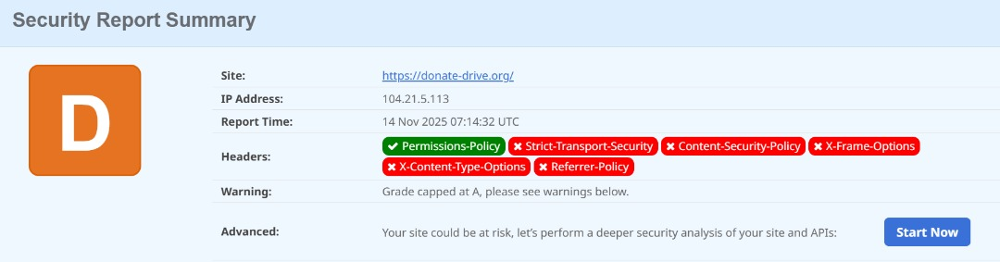
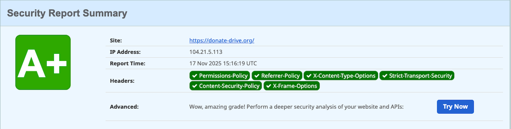

# Web-Security-Posture-Hardening-for-donate-drive.org
This project documents the successful implementation of critical HTTP security headers on a production WordPress website using Cloudflare Transform Rules to achieve an A+ security rating and significantly mitigate common web vulnerabilities.
## Project Overview

| Metric | Before Implementation | After Implementation |
| :--- | :--- | :--- |
| **Security Grade** | **Failing/Warning State** | **A+ Grade** |
| **Critical Headers** | 6 Headers Missing/Incorrect | All Headers Successfully Deployed |

### Technologies Used

* **Platform:** WordPress
* **CDN/Proxy:** Cloudflare (Primary implementation tool)
* **Methodology:** Cloudflare Transform Rules (Modify Response Headers)
* **Auditing Tool:** Security Headers Scanner

## Key Accomplishments

* **Security Transformation:** Elevated the site's security posture from a failing state **D** to a certified **A+** grade by implementing a full suite of best-practice HTTP Security Headers.
* **Cloudflare Integration:** Leveraged the network edge (Cloudflare) for efficient, centralized header deployment, minimizing latency and origin server configuration complexity.
* **Custom CSP Development:** Designed and rigorously tested a functional **Content-Security-Policy (CSP)** that allowed essential third-party services (Google Analytics, Google Fonts) while maintaining maximal defense against unauthorized script execution (XSS).
* **Compliance:** Ensured adherence to contemporary web security and privacy standards (e.g., Referrer-Policy for data leakage control).

## Implementation Details: Final Header Configuration

The final, functional HTTP security headers configured via Cloudflare (using the policy optimized for the A+ rating) are listed below.

| Header Name | Final Configuration Value | Purpose |
| :--- | :--- | :--- |
| `Strict-Transport-Security` | `max-age=12 months; includeSubDomains` | Enforces HTTPS encryption. |
| `X-Content-Type-Options` | `nosniff` | Blocks MIME-sniffing attacks. |
| `Referrer-Policy` | `strict-origin-when-cross-origin` | Protects user privacy by limiting referrer information. |
| `X-Frame-Options` | (Handled by CSP) | Prevents Clickjacking. |
| `Permissions-Policy` | `geolocation=(), camera=(), payment=(), usb=(), fullscreen=(self)` | Restricts browser APIs. |
| `Content-Security-Policy` | *See Full Policy below* | Mitigates XSS and data injection. |

### Final Content-Security-Policy (CSP)
*(The strict policy used to achieve the A+ grade for documentation)*

```text
default-src 'self';
script-src 'self' https://www.googletagmanager.com https://www.google-analytics.com;
style-src 'self' https://fonts.googleapis.com;
font-src 'self' https://fonts.gstatic.com;
img-src 'self' data: https://www.google-analytics.com;
connect-src 'self' https://www.googletagmanager.com https://www.google-analytics.com;
frame-src 'self' https://www.youtube.com https://player.vimeo.com;
object-src 'none';
frame-ancestors 'self';
upgrade-insecure-requests;
```

### Attacks Mitigated by This Configuration
The implementation of these headers creates a defense-in-depth approach, preventing or mitigating entire classes of attacks:

| Security Header | Primary Attack Mitigation | Description |
| :--- | :--- | :--- |
| `CSP` | Cross-Site Scripting (XSS) | Blocks the browser from executing scripts or loading content from unauthorized domains. |
| `HSTS` | Protocol Downgrade | Eliminates risk of Man-in-the-Middle (MITM) attacks by ensuring all traffic is encrypted. |
| `X-Frame-Options` | Clickjacking | Prevents the site from being embedded in a malicious iframe to trick users into clicking. |
| `X-Content-Type-Options` | MIME-Sniffing | Stops attackers from disguising malicious files (like scripts) as safe resources. |
| `Referrer-Policy` | Sensitive Data Leakage | Restricts the exposure of internal URLs or parameters when navigating to external websites. |
| `Permissions-Policy` | Feature Abuse | Blocks unauthorized access to powerful device features (e.g., camera, microphone) by third-party scripts. |

### Before & After Security Audit
To visually demonstrate the project's impact, the following images showcase the security grading before and after the header implementation.

**Before Implementation (Failing State):**

**After Implementation (A+ Grade):**

